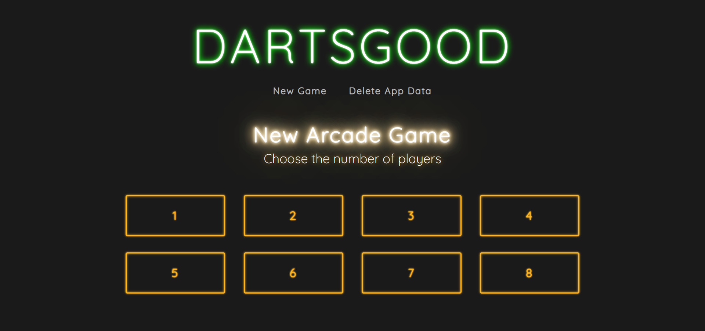
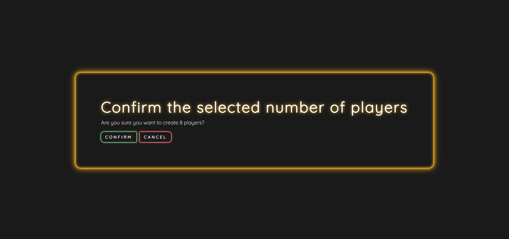
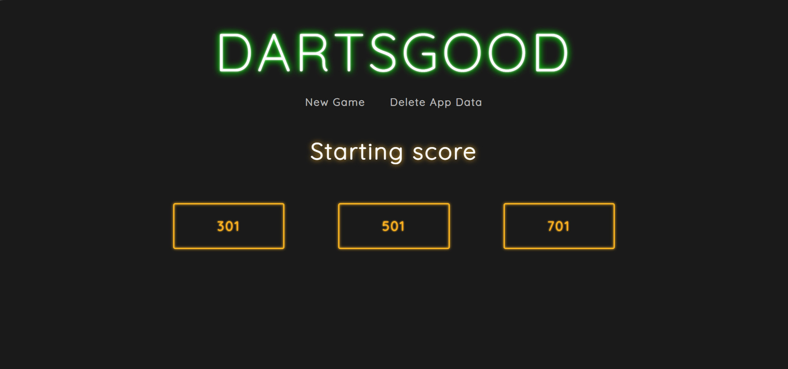
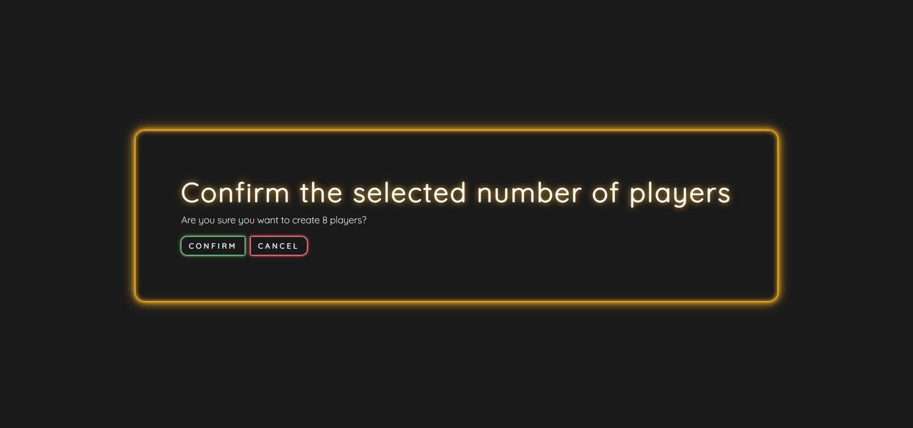
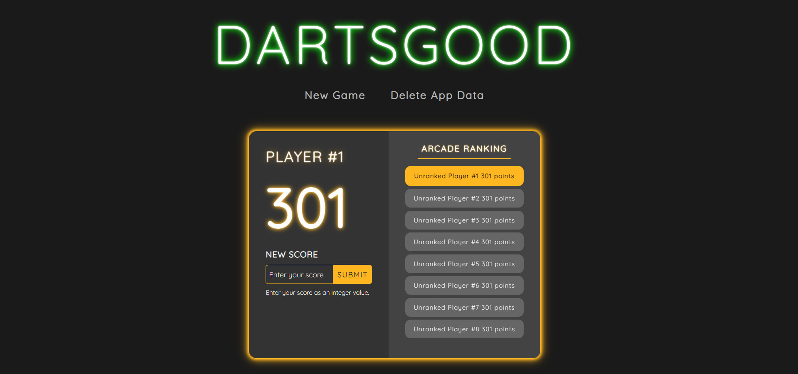
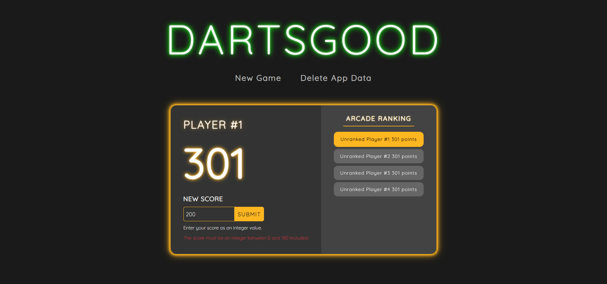
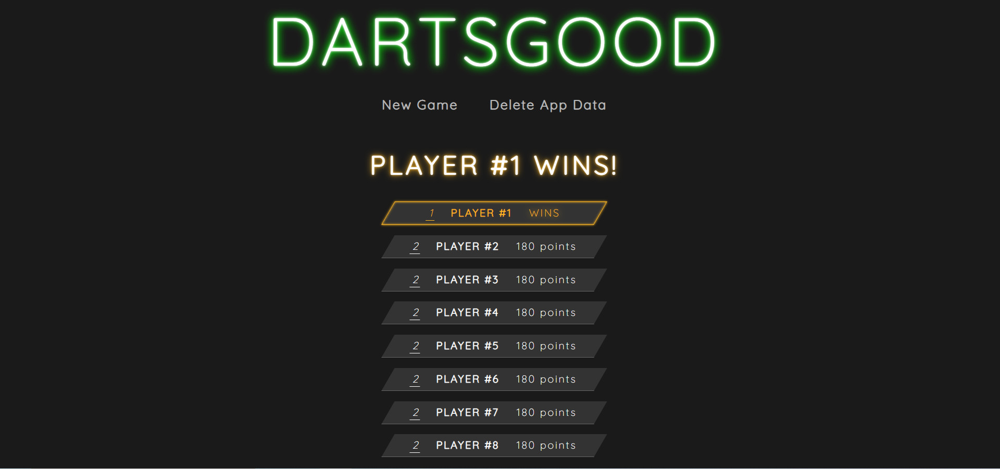
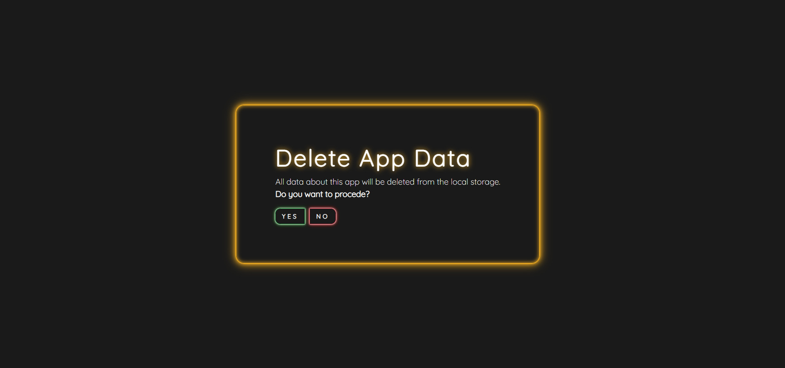
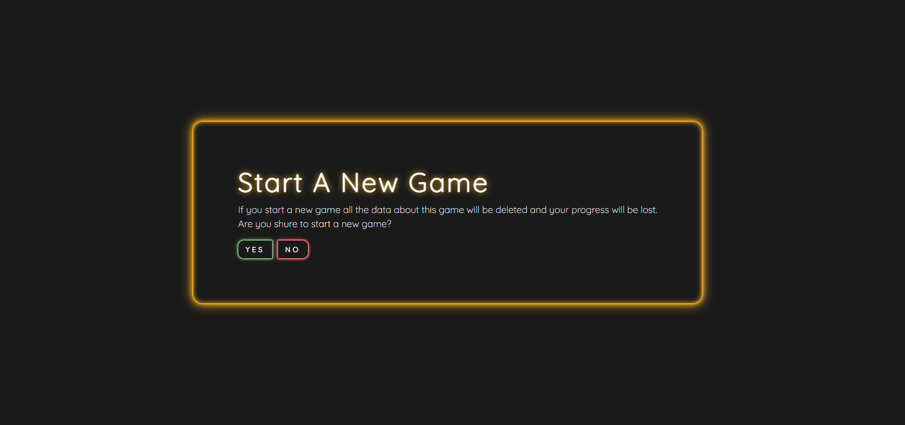
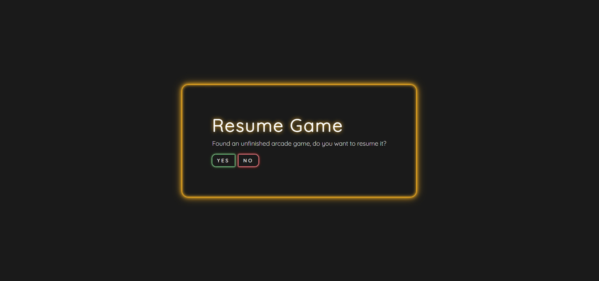

# Dartsgood

# Table of Contents
1. [What Is Dartsgood](#What-Is-Dartsgood)
2. [How Dartsgood Works](#How-Dartsgood-Works)
    1. [User Experience](#User-Experience)
        1. [Demo GIF](#Demo-GIF)
        2. [Select Number Of Players](#Select-Number-Of-Players)
        3. [Select Starting Score](#Select-Starting-Score)
        4. [Game Interface](#Game-Interface)
        5. [Navigation Menu](#Navigation-Menu)
        6. [Technical Features](#Technical-Features)
            1. [Data Persistence](#Data-Persistence)
            2. [Sorting](#Sorting)
            3. [Recover Game](#Recover-Game)
3. [Why Dartsgood Where Developed](#Why-Dartsgood-Where-Developed)
4. [Who Developed Dartsgood](#Who-Developed-Dartsgood)
5. [How Dartsgood Was developed](#How-Dartsgood-Was-Developed)
    1. [Languages](#Languages)
    2. [Toolkit](#Toolkit)
    3. [IDE](#IDE)
6. [How To Improve Dartsgood](#How-To-Improve-Dartsgood)
    1. [Game modality](#Game-modality)
    2. [UX](#UX)
    3. [IoT](#IoT)
    4. [Data Persistence And Management](#Data-Persistence-And-Management)
    5. [Data Analytics](#Data-Analytics)

## What Is Dartsgood
Dartsgood is a single page JavaScript application that allows you to keep track of the evolution of players' scores during darts matches in so called "01 modes".

The application is designed for between 1 and 8 players.
301, 501 and 701 are the three starting points that players can select.
The application is able to generate the provisional classification and the final ranking of the players who take part in the games.

## How Dartsgood Works
Before starting to use Dartsgood it is necessary to know the number of players who will take part in the game and the order in which they will shoot during a round.

### User Experience

#### Demo GIF
The following GIF image shows a common interaction between user and application.

#### Select Number Of Players
The number of players selection screen allows you to notify the system of the number of players who will take part in the game. The screen has 8 buttons to select the number of players, each of them showing a number that corresponds to the number of players for which you want to keep track of the scores.

After pressing one of the buttons for selecting the number of players, the system will show a confirmation screen, if you want to confirm your choice you must press the "confirm" button otherwise, to cancel, you must press the "cancel" button.

#### Select Starting Score
After selecting the number of players, the system will show the user the initial score selection screen.
This screen consists of three starting score selection buttons. Each button has a number representing the amount of points each user will start the game with.

After having pressed one of the starting score selection buttons, a confirmation screen will appear, to confirm the choice press the "confirm" button, to cancel press the "cancel" button.

#### Game Interface
After selecting the starting score, the system will show the game interface to the user .
The game interface consists of the player panel and the ranking panel.

The player panel shows:
- The character id
- The position in the ranking of the character if he is classified.
- The number of points remaining.
- The text field in which to insert the score obtained after throwing the three darts.
- The button that allows you to send the score achieved to the system

The ranking panel shows where all players are at that moment by reporting information about:
- Player ranking position
- Player ID
- Remaining points

The text-field dedicated to the score obtained after the three shots requires the user to enter a single whole number that adds up the result of all three shots. The score obtained in this way is called the shooting score.
When the text-field dedicated to the shooting score is populated and after the button to send the score is pressed, the system performs the necessary checks:
- If the input is correct, the game will progress. In this scenario the game interface will load and show the user the data of the next player to shoot.
If the input is badly formatted, the system will show the user an error message inviting them to respect the formatting provided for this data.

The first player to reach 0 wins.
In this case, the system will display the victory screen and the end of the game screen. This screen will show the name of the big winning player and the final ranking.

#### Navigation Menu
The navigation menu offers two items:
- New match
- Delete App Data
Both options will clear the data from the system and return the player to the number of players selection screen.

By clicking on any menu item the system will show a confirmation screen.
If the user presses on "confirm" the system will perform the requested action. If the user presses the "cancel" button then the system will do nothing and will remain in the state it is currently in.

#### Recover Game
If a user inadvertently closes the browser, everything is fine. In fact, returning to the Dartsgood page, a confirmation message will appear that will alert the user by telling him that the system has found a game that has not yet been completed. The system will ask the user if he wants to continue the match found and the user will have two options:
- Press the "yes" button, asking the system to retrieve the information found and allow the user to resume from where he left off.
- Press the "no" button, asking the system to delete the data found and to show the user the screen for selecting the number of players.

### Technical Features

#### Data Persistence
It keeps track of all the information necessary for the correct functioning of the application by saving the data of interest through the use of LocalStorage. To delete the data from the LocalStorage you can, very simply, click on the menu item "Delete App Data".

#### Sorting
The sorting of information is done through a Quicksort implementation using the JavaScript scripting language. The algorithm allows you to sort JavaScript objects based on the criteria passed as the function argument. The algorithm is able to choose which pivot to use and therefore whether to choose the final or one chosen randomly in order to reduce the bad cases of this algorithm.

#### Recover Game
The system implements data persistence using the LocalStorage API.

## Why Dartsgood Where Developed
Dartsgood was created to meet different needs including: passion for development, demonstration purpose and personal use.

We thought that enthusiasts of programming, design, data analysis and darts game could be interested in the developed code, and in the idea behind Dartsgood, in order to create a real collaborative open source project.

## Who Developed Dartsgood
Dartsgood was originally developed in september 2021 by:
- [Laura Saccomanno](https://www.linkedin.com/in/laura-saccomanno/): in the role of designer and developer.
- [Michele Greco](https://www.linkedin.com/in/michele-greco-informatico/): in the role of designer and developer.

## How Dartsgood Was developed
Dartsgood was developed using the following technologies:

### Languages
- HTML: used to create the single page structure and content.
- CSS/SASS: used to style the single page application and to create animations.
- JavaScript: used to manipulate DOM, to implement all the application mechanics and to implement the data persistence.
    - LocalStorage API: used to implement the data persistence.
    - Quicksort algorithm: the JavaScript implementation of this algorithm is used to sort player score, following several criteria, in order to create the players ranking.
### Toolkit
- Bootstrap: used for fast front-end development.

### IDE
- Visual Studio Code: used for the development of the whole project.

## How To Improve Dartsgood
Dartsgood was born thanks to a simple idea: "Easily keep track of scores while playing darts for fun".

We would be delighted if this idea and the code we made in our free time could inspire someone to create something bigger or combine the strengths of similar applications that already exist.

### Game modality
One of the aspects of the application to enhance is the number of game modes that Dartsgood supports. It would be great to implement all the existing game modes and to create new ones.

### UX
One of the features to be enhanced in Dartsgood is the insertion of the points scored by the player after making the three shots.
To better understand our idea, we express it in the form of a user story: "As a player who has made the three shots during my turn, I must be able to click within the application, on a target shot digitally represented, in order to indicate to the system which sections of the board I hit with my three shots."

### IoT
In the year in which Dartsgood was created, the IoT is a discipline and technology that manages to be integrated into any application.
It would be great to be able to link arduino projects that follow the rules of darts to the Dartsgood application. In this way the system would be able to manage two types of score entry: the classic manual one and the automatic one through communication of IoT devices.

### Data Persistence And Management
Dartsgood is currently an idea and a project for demonstration purposes, it would need an implementation with more efficient and scalable persistence systems.

Incorporating application support APIs, client-server architecture, or other thoughtful solutions could be a huge step forward for Dartsgood.
Implementing such a structured system would give the possibility to implement numerous other functions.

### Data Analytics
If Dartsgood had a database it would be possible to analyze the data collected by the system.
It would be interesting to create an account system in which each player keeps track of their scores and progress over time.

Data analysis capabilities could indicate player shooting trends, times and conditions in which the best shots were taken, and predict the progress of improvements based on training pace and methodology.
